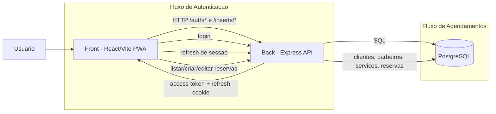
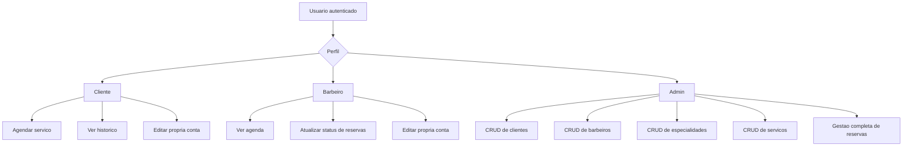

# App PWA - Nicatto Beard

Monorepo com dois projetos:

- back: API Node.js (Express + PostgreSQL) em TypeScript
- front: aplicação React (Vite) com suporte a PWA, usando TSX

## Estrutura

- back: API, autenticação, regras de negócio e seed
- front: interface web, autenticação em sessão e CRUDs
- back/db/init.sql: criação inicial das tabelas

## Diagrama da Arquitetura

## Diagrama de Permissoes por Perfil

## Pré-requisitos

- Node.js 20+
- Docker Desktop (recomendado para subir o PostgreSQL local)

## Rodando em desenvolvimento

### 1) Backend

Em um terminal:

1. cd back
2. npm install
3. npm run db:up
4. npm run dev

API padrão:

- http://localhost:3001

### 2) Frontend

Em outro terminal:

1. cd front
2. npm install
3. npm run dev

Vite em porta disponível (ex.: 5173, 5174, 5175...).

## Docker local

### Backend + banco

1. cd back
2. docker compose up -d --build

- API: http://localhost:3001
- PostgreSQL: localhost:5432

### Frontend

1. cd front
2. docker compose up -d --build

- Frontend (Nginx): http://localhost:8080

### Encerrar

- cd back && docker compose down
- cd front && docker compose down

## Observações 

- Tomei liberdade de criar uma categoria de serviços, com caracteristicas mais especificas como valor e tempo médio, que se liga a especialidades que por sua vez se liga aos barbeiros. Isso faz com que a lógica inicial seja mantida, o barbeiro só pode ser selcionado se for especialista na área daquele serviço, mas se aproxime mais do mundo real.

- O tempo médio de atendimento foi setado para 30 minutos, como solicitado, mas existem outras opções na página de cadastro.

- O calendário do admin mostra todos atendimentos que não estejam cancelados, cada barbeiro tem uma cor especifica no calendário, para facilitar a identificação, esta cor é selecionada no momento do cadastro do barbeiro. Para ter mais informações sobre a reserva ou edita-la, basta clicar sobre ela.